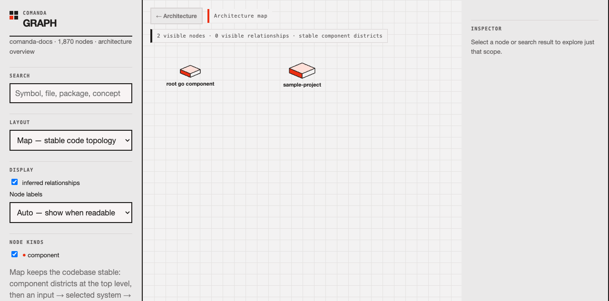
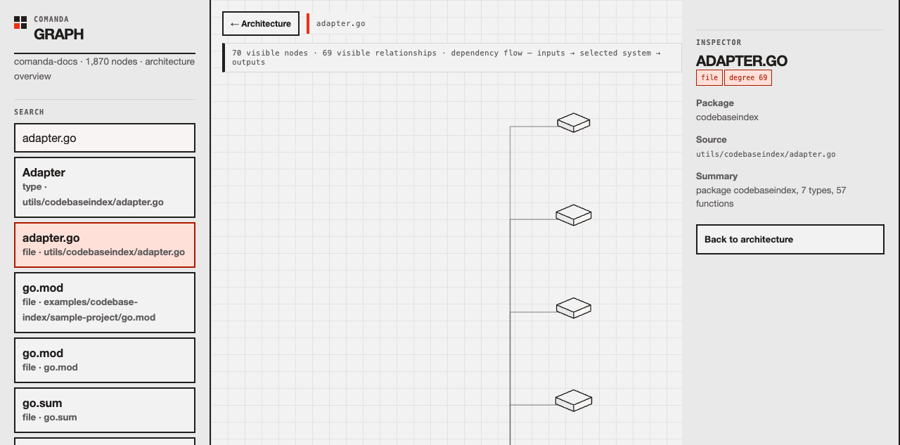

# comanda

> **Make coding agents earn their exit.**
>
> Comanda is the terminal-native runtime for durable, self-improving agent work in a repository. Describe a workflow in English, inspect the generated program, run the coding agents you already use, and stop only when your own quality gates say the work is done.

[](https://github.com/kris-hansen/comanda)
[](https://github.com/kris-hansen/comanda/releases)
[](https://opensource.org/licenses/MIT)

## From an idea to a governed workflow

Comanda starts with English, but ends with a YAML program you can inspect, version, and improve.

```bash
# Describe the outcome
comanda generate feature-loop.yaml \
  "Implement this feature until tests and security checks pass"

# Inspect the generated workflow as a graph
comanda chart feature-loop.yaml --format mermaid

# Run it in your repository
comanda process feature-loop.yaml

# Evolve the program with plain-English feedback
comanda improve feature-loop.yaml \
  "Add a Codex reviewer and require typecheck before completion"
```

**Describe it. Inspect it. Run it. Improve it. Commit it.**

## A loop does not finish because an agent says “DONE”

Long-running work needs an observable exit criterion. Comanda's agentic loops persist state, refine subsequent prompts from prior results, and run automated quality gates after each iteration. Interrupt a run and resume it from its last checkpoint.

When deterministic gates prepare files consumed by a loop's first step, set
`quality_gates_before_steps: true`; the default remains post-step validation.

```yaml
agentic-loop:
  config:
    name: code-quality-improvement
    stateful: true
    checkpoint_interval: 2
    max_iterations: 10
    prompt_improvement:
      enabled: true
    quality_gates:
      - name: syntax-check
        type: syntax
        on_fail: abort
      - name: tests
        command: "make test"
        on_fail: retry
    allowed_paths: ["./src", "./tests"]
```

Run the complete [code-quality loop](examples/agentic-loop/code-quality-loop.yaml), then inspect or resume it:

```bash
comanda process examples/agentic-loop/code-quality-loop.yaml
comanda loop status code-quality-improvement
comanda loop resume code-quality-improvement
```

Comanda supports retry, abort, and skip policies; syntax, security, and custom-command gates; bounded or indefinite runs; and creator/checker or dependent multi-loop workflows. See [agentic-loop examples](examples/agentic-loop/README.md).

## Use the agents you already have

Coordinate Claude Code, Gemini CLI, OpenAI Codex, Kimi Code, API models, and local models in one workflow. Give agents distinct roles, pass work through files or standard input/output, and keep the results visible in your repository.

```yaml
parallel-process:
  architecture:
    input: STDIN
    model: claude-code
    action: "Review the design and identify implementation risks."
    output: .comanda/architecture-review.md

  implementation:
    input: STDIN
    model: openai-codex
    action: "Review the implementation plan and identify practical risks."
    output: .comanda/implementation-review.md

synthesize:
  input:
    - .comanda/architecture-review.md
    - .comanda/implementation-review.md
  model: gemini-cli
  action: "Produce one prioritized recommendation."
  output: STDOUT
```

Run this exact [parallel-review workflow](examples/multi-agent/parallel-review.yaml) with `git diff | comanda process examples/multi-agent/parallel-review.yaml`, or explore [multi-agent workflows](examples/multi-agent/README.md) and [parallel processing](examples/parallel-processing/).

## Keep agent work inside the repository model

- **Git worktrees** — run parallel implementations in isolated branches, then inspect and compare their diffs.
- **Codebase indexes** — capture repository structure, symbols, conventions, operational notes, and risk areas for later agent work; incrementally update or diff an index as the code changes.
- **Explicit boundaries** — constrain agentic loops to allowed paths and named tools.
- **Quality gates** — use your own tests, linters, and security checks as the definition of done.

```bash
comanda index capture --enhance
comanda index diff my-project
comanda index update my-project
```

See [codebase-index examples](examples/codebase-index/README.md).

## Build a workflow once. Run it everywhere.

Workflows are plain files. Review them in pull requests, run them from the terminal or CI, serve them over HTTP, or expose them to MCP clients.

```bash
# Expose checked-in workflows as MCP tools and skills as MCP prompts
comanda mcp

# Run a workflow as part of a shell pipeline
git diff | comanda process review.yaml
```

See the [MCP server guide](docs/mcp-server.md), [server API](docs/server-api.md), and [skills examples](examples/skills/README.md).

## Why Comanda?

| If you need to… | Reach for… |
| --- | --- |
| Build an AI-powered application in code | An agent framework such as LangGraph, CrewAI, or an SDK |
| Design a business automation on a visual canvas | A visual workflow platform |
| Ask one coding agent to complete a task | Its native CLI |
| Generate, govern, resume, and reuse durable agent work in a repository | **Comanda** |

Comanda sits between a coding agent and an agent framework: it turns agent work into a durable, reviewable program that runs where developers already work.

## Install

```bash
# macOS
brew install kris-hansen/comanda/comanda

# Go
go install github.com/kris-hansen/comanda@latest
```

See [GitHub Releases](https://github.com/kris-hansen/comanda/releases) for prebuilt binaries for macOS, Linux, and Windows.

## More capabilities

- Generate and improve workflows from natural-language feedback
- Render workflow structure as terminal or Mermaid graphs with validation
- Process files, URLs, images, PDFs, databases, and batches with chunking
- Use shell tools with explicit allowlists
- Call OpenAI, Anthropic, Google, xAI, DeepSeek, Moonshot, Sakana, Ollama, vLLM, llama.cpp, and compatible providers
- Run workflows as HTTP endpoints or OpenAI-compatible server routes

## Durable Semantic Memory

Comanda has two complementary memory modes:

- `memory: true` retains the original behavior: inject the configured
  `COMANDA.md` file in full.
- A `memory:` mapping performs bounded, project-local semantic recall from a
  SQLite FTS5 database. It is opt-in, namespace-scoped, and each recalled
  record keeps a durable ID and source reference.

Seed a project memory with independently understandable facts:

```bash
comanda memory add --namespace project --type decision \
  --source architecture-2026-07 "Use SQLite FTS5 for local durable-memory retrieval."
comanda memory search --namespace project "local memory retrieval"
```

Then enable recall for only the step that needs it:

```yaml
review:
  input: STDIN
  model: openai-codex
  memory:
    namespace: project
    recall:
      query: input
      limit: 6
      max_chars: 6000
      types: [decision, constraint, failure]
  action: "Review this change and cite relevant memory IDs."
  output: STDOUT
```

The database is stored at `.comanda/memory/<namespace>.db` by default. Use
`comanda memory show <id>` to inspect recalled evidence and its provenance.
See [examples/semantic-memory.yaml](examples/semantic-memory.yaml) for a
complete workflow. Automatic fact extraction, deduplication, and project-state
compaction are planned as the next layer; this first release deliberately
keeps persistence explicit and inspectable.

## Knowledge Graphs

A codebase index can be turned into a traversable knowledge graph stored in
the semantic memory database. Extraction is deterministic and local: the index
scan contributes components, packages, files, symbols, and imports as typed
edges tagged `EXTRACTED` (explicit in the source) or `INFERRED` (name
resolution, or an optional AI pass).

```bash
comanda index capture -n myproject --graph      # index + graph in one run
comanda graph build myproject                   # or build from a registered index
comanda graph explain Store                     # a node and its connections
comanda graph path main Store                   # shortest connection between nodes
comanda graph query "what uses the store?"      # scoped subgraph for a question
comanda graph stats                             # counts and hub nodes
comanda graph export -o graph.json              # graphify-style JSON
comanda graph visualize                          # interactive local graph navigator
```

`comanda graph visualize` opens a localhost-only browser view for navigating
complex code structures. It begins with a small architecture overview, then
loads and caches only the selected node's direct neighborhood in 160-edge
pages. Search finds symbols, files, packages, and concepts; selecting a result
focuses its connected neighborhood rather than transferring an unusable
all-symbol hairball. Inspector mode also accepts durable human guidance for a
selected file, component, or symbol; it survives graph rebuilds and is included
in graph-aware agent recall. The navigation contract is available to native
clients through the visualizer and the configured Comanda server:

### Explore a codebase as a map

The default **Map** layout makes architecture and dependency direction stable:
components appear as districts, and drilling into a file or symbol presents its
dependencies as a layered flow. Use the optional **Focus** layout when a radial
one-to-three-hop neighborhood is the better question. Labels automatically
appear when the current scope is readable, with `Always` and `Selected only`
controls available for dense graphs. The visualizer follows the system light or
dark mode and never sends code or graph data off the machine.

<p align="center">
  
</p>

<p align="center"><em>Architecture overview of Comanda's own codebase.</em></p>

Search and open a result to bring only its useful local structure into view.
The relationship pages are cached in the browser, so moving through a large
repository stays responsive rather than reloading the entire graph.

<p align="center">
  
</p>

<p align="center"><em>A file-level dependency flow from the same Comanda graph.</em></p>

```bash
# Build once, then open a local interactive map for the current project
comanda index capture ./my-project -n myproject --graph
cd ./my-project
comanda graph visualize

# Headless/local-client mode prints the localhost URL instead of opening it
comanda graph visualize --no-open --port 8088
```

```text
GET /graph/overview?namespace=myproject
GET /graph?namespace=myproject
GET /graph/search?namespace=myproject&q=Store
GET /graph/neighbors?namespace=myproject&focus=store&limit=160&offset=0
GET /graph/subgraph?namespace=myproject&focus=store&depth=2
```

The localhost visualizer additionally exposes its annotation endpoint for
Canvas-style clients:

```text
GET /api/v1/annotations?node_id=<node-id>
POST /api/v1/annotations  {"node_id":"<node-id>","content":"human guidance"}
```

The browser visualizer serves equivalent endpoints below `/api/v1/` and binds
only to `127.0.0.1`. Graph reads never modify the database.

Graph nodes are mirrored into the memory FTS index as `graph_node` records, so
workflow steps recall them with the existing memory mapping
(`types: [graph_node]`).

The same namespace doubles as long-lived agentic context: seed it with project
decisions and constraints, then let a stateful loop recall graph structure and
project rules on every iteration — bounded by `limit` and `max_chars`, so the
loop gets focused context instead of the whole index.

```bash
comanda index capture -n myproject --graph    # index + knowledge graph
comanda memory add --namespace myproject --type decision \
  --source architecture "Keep provider interfaces stable across refactors."

echo "Improve error handling in the storage layer" | \
  comanda process examples/knowledge-graph/codebase-context-loop.yaml
```

See [examples/knowledge-graph/](examples/knowledge-graph/README.md)
and the [design doc](docs/design/knowledge-graph.md).

Browse [all examples](examples/README.md) or visit [comanda.sh](https://comanda.sh) for documentation and templates.

## Development

```bash
make deps
make build
make test
```

## License

MIT

## Download History

[](https://skill-history.com/kris-hansen/comanda)
